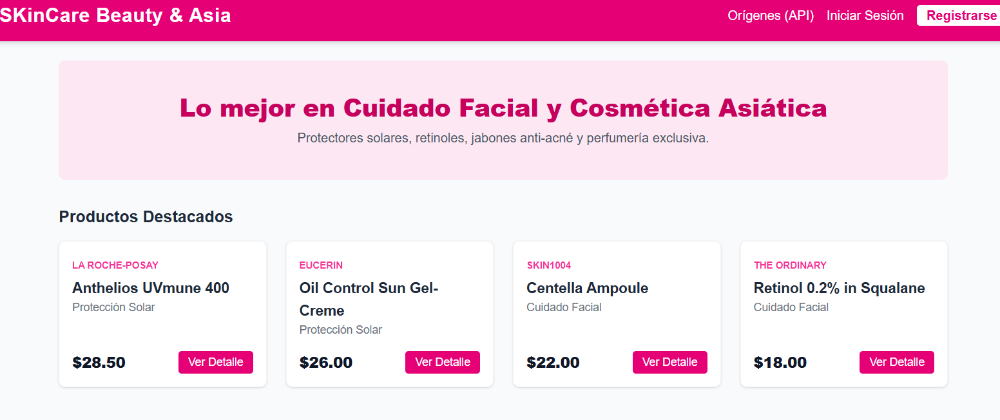
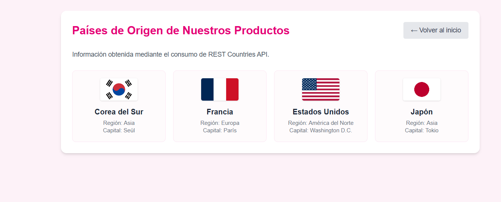

# SKinCare Beauty & Asia 💄

Aplicación Web Full-Stack **e-commerce** especializada en productos para el cuidado de la piel y cosmética coreana (K-Beauty): protectores solares, retinoles, jabones anti-acné y perfumería. Un **proyecto integrador** que aplica todo el stack Full-Stack aprendido: Next.js, Supabase, autenticación con roles, Server Actions y despliegue en producción.

> 🔗 **Demo en vivo:** https://skincare-beauty-asia.vercel.app
> 🎬 **Video de defensa (YouTube / Google Drive):** *(pega aquí el enlace antes de entregar)*

---

## Capturas de pantalla




---

## Stack tecnológico

| Capa | Tecnología |
|------|-----------|
| Framework | Next.js 14 (App Router) |
| Lenguaje | TypeScript (tipado estricto, sin `any`) |
| Estilos | Tailwind CSS |
| Base de datos | Supabase (PostgreSQL) |
| Autenticación | Supabase Auth + Row Level Security (RLS) |
| API externa | REST Countries API (`restcountries.com`) |
| Mutaciones | Server Actions |
| Despliegue | Vercel |

---

## Roles de usuario

**👑 Administrador**
- Accede al `/dashboard` (protegido por middleware).
- **Crea**, **lee**, **actualiza** y **elimina** productos (*CRUD completo* mediante Server Actions).
- Gestiona el inventario: nombre, marca y precio.

**🛍️ Cliente / Lector**
- Explora el catálogo público de productos.
- Visita el detalle de cada producto (ruta dinámica).
- Guarda productos en **Mis Favoritos** (relación N:M con la tabla `productos`).
- Consulta información dinámica del origen de las marcas (API externa).

---

## Modelo de datos

El modelo relacional usa **3 tablas** con llaves foráneas y **Row Level Security (RLS)** activado:

```
auth.users (Supabase Auth)
     │ 1
     │
     ▼ 1
profiles  ◄──────────────┐ (FK: profiles.id → auth.users.id)
  - id (PK, FK)          │
  - full_name            │
  - role ('user'|'admin')│
                         │
productos ──────────────►│
  - id (PK)              │ relación N:M
  - nombre               │
  - marca                │
  - precio               │
                         │
favoritos ───────────────┘
  - id (PK)
  - user_id (FK → auth.users.id)
  - producto_id (FK → productos.id)
  - UNIQUE(user_id, producto_id)
```

**Relaciones:**
- `profiles.id → auth.users.id` (1 a 1): cada perfil extiende la información del usuario autenticado.
- `favoritos.user_id → auth.users.id` (1 a muchos): un usuario tiene muchos favoritos.
- `favoritos.producto_id → productos.id` (1 a muchos): un producto puede estar en muchos favoritos.

Las **políticas RLS** garantizan que: los productos son de solo lectura para visitantes, solo el admin puede crear/editarlos/eliminarlos, y cada usuario solo ve/administra sus propios favoritos.

---

## Instalación local

```bash
git clone https://github.com/changmargian-svg/skincare-beauty-asia.git
cd skincare-beauty-asia
npm install
cp .env.example .env.local   # completa con tus claves de Supabase
npm run dev
```

Abre [http://localhost:3000](http://localhost:3000) en tu navegador.

> **Importante:** Ejecuta el script `supabase/seed.sql` en el SQL Editor de tu proyecto Supabase para crear las tablas `profiles`, `productos`, `favoritos`, activar RLS y crear el trigger de perfiles.

---

## Variables de entorno

Crea un archivo `.env.local` en la raíz (ya está excluido de Git en `.gitignore`):

```
NEXT_PUBLIC_SUPABASE_URL=https://TU-PROYECTO.supabase.co
NEXT_PUBLIC_SUPABASE_ANON_KEY=TU_ANON_PUBLIC_KEY
```

Obtén estos valores en: **Supabase Dashboard → Project Settings → API**. Nunca subas `.env.local` a GitHub.

---

## Credenciales de prueba

| Rol | Email | Contraseña |
|-----|-------|-----------|
| **Administrador** | `admin.skincare.test@gmail.com` | `admin123` |
| **Cliente** | `cliente.skincare.test@gmail.com` | `cliente123..` |

---

## Demostración técnica (para el video de defensa)

### 1. Arquitectura Full-Stack
El proyecto separa correctamente **Server Components** (renderizan en el servidor: la home, el catálogo y el dashboard leen la base de datos) de **Client Components** (interactivos: el buscador con `useState`, el botón de favoritos y el cierre de sesión). La regla `'use client'` solo se usa donde hay estado o eventos.

### 2. Consumo de API externa (REST Countries)
En `app/origenes/page.tsx` se consume `https://restcountries.com` con **`fetch` + `async/await`** desde un **Server Component**, con caché (`next: { revalidate: 3600 }`) y un **manejo de errores** con datos de respaldo (`fallback`) si la API falla. Se muestran banderas, región y capital de los países de origen de la cosmética.

### 3. Base de datos y Seguridad (RLS)
Supabase almacena el contenido generado por los usuarios (productos y favoritos). Hay **3 tablas relacionadas** (`profiles`, `productos`, `favoritos`) con **llaves foráneas** y **Row Level Security** activado en todas. Las políticas garantizan que: los visitantes solo **leen** el catálogo, solo el **admin** puede crear/editar/eliminar productos, y cada usuario solo ve sus **propios** favoritos.

### 4. Autenticación con roles
El **registro** crea la cuenta y el perfil con su rol (vía trigger `handle_new_user`). El **login** consulta el `role` en `profiles` y redirige: admin → `/dashboard`, cliente → `/`. El **middleware** protege las rutas privadas de forma doble (nivel red y nivel servidor). El rol **no está hardcodeado**, se guarda en la base de datos.

### 5. CRUD completo con Server Actions
Las mutaciones (`app/actions.ts`) usan **Server Actions**: `agregarProductoServerAction` (crear), `actualizarProductoServerAction` (editar) y `eliminarProductoServerAction` (borrar). Cada una valida la autenticación y el rol admin antes de tocar la base de datos.

---

## Funcionalidades (checklist de requisitos)

✅ Sistema con **2 roles** (admin / cliente) con permisos distintos
✅ **3 rutas públicas**: `/` (home), `/productos`, `/origenes`, `/login`, `/register`
✅ **Rutas privadas protegidas con middleware**: `/dashboard` (admin) y `/favoritos` (sesión)
✅ **Ruta dinámica**: `/productos/[id]`
✅ **CRUD completo** conectado a Supabase (Server Actions): crear, leer, actualizar y eliminar productos
✅ **Autenticación real**: registro, login y cierre de sesión con Supabase Auth
✅ **3 tablas con llaves foráneas** y **Row Level Security** activado
✅ **Componente de búsqueda** con `useState` (Client Component)
✅ **Correcta separación** de Server Components vs Client Components
✅ **Consumo de API externa** (REST Countries) con `fetch` + `async/await` + manejo de errores
✅ **Despliegue** en Vercel
✅ Repositorio en GitHub con historial de commits

---

## Estructura de carpetas

```
skincare-beauty-asia/
├── app/
│   ├── layout.tsx              # Layout global
│   ├── page.tsx                # Home (pública, lee productos de Supabase)
│   ├── productos/
│   │   ├── page.tsx            # Catálogo completo (público + buscador)
│   │   └── [id]/page.tsx       # Detalle del producto (ruta dinámica)
│   ├── favoritos/page.tsx      # Favoritos del usuario (privada, sesión)
│   ├── origenes/page.tsx       # Países de origen (API externa)
│   ├── dashboard/
│   │   ├── layout.tsx          # Layout protegido (solo admin)
│   │   ├── page.tsx            # Panel CRUD (listar productos)
│   │   ├── nuevo/page.tsx      # Crear producto
│   │   └── [id]/editar/page.tsx# Editar producto
│   ├── login/page.tsx          # Login
│   ├── register/page.tsx       # Registro
│   └── components/             # Componentes reutilizables
├── lib/
│   ├── supabase.ts             # Cliente Supabase (browser)
│   └── supabase-server.ts      # Cliente + helpers de servidor
├── middleware.ts               # Protección de rutas
├── supabase/seed.sql           # Script SQL (tablas + RLS)
├── .env.example
└── README.md
```

---

## Autor

**Margian Maylee Chang Ordóñez**
Proyecto Integrador — Aplicaciones Web (Segundo Parcial)
